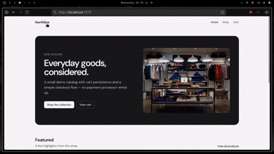

# Northline Goods - ecommerce demo

A small **React** storefront built with **Vite**, **JavaScript**, **Tailwind CSS v4**, and **React Router**. It includes a static product catalog, a shopping cart persisted in the browser (`localStorage`), and a simple checkout flow (demo only).

# [View the page live](https://reactwebsite-olive.vercel.app/)


   
   

## Prerequisites

- **Node.js** 20+ (LTS recommended) — [https://nodejs.org](https://nodejs.org)
- **npm** (comes with Node)

Check versions:

```bash
node -v
npm -v
```

## Getting started 

1. **Clone** the repository (or copy the project folder).

   ```bash
   git clone https://github.com/basiilll/reactwebsite.git
   cd ecommerce-basic
   ```

2. **Install dependencies** 

   ```bash
   npm install
   ```

3. **Start the dev server** 

   ```bash
   npm run dev
   ```

4. Open the URL Vite prints — usually **http://localhost:5173**


